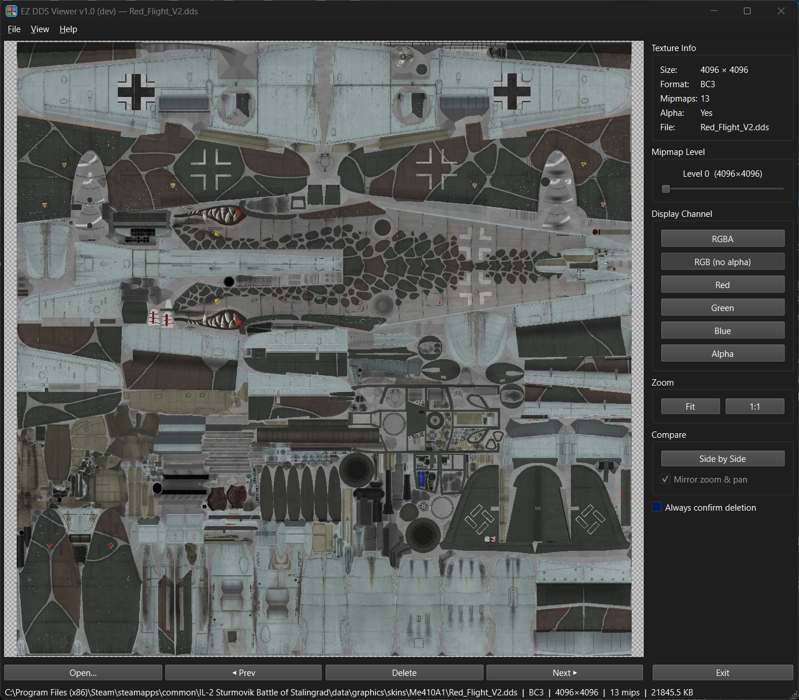

# EZ DDS Viewer

A lightweight Windows desktop app for viewing DDS texture files, built for IL-2 Sturmovik skin modding.

## Features

### Opening Files
- **File → Open** or press `Ctrl+O`
- Per-panel **Open…** button on each image panel
- **Drag & drop** a `.dds` file directly onto the window
- **Recent Files** — File → Open Recent keeps your last 10 opened files
- The Open dialog remembers the last folder you used

### Viewing
- **Checkerboard background** shows transparency clearly
- **Mipmap selector** — slide through all mip levels; each level shows its exact pixel size
- **Channel display** — switch between RGBA, RGB, Red, Green, Blue, and Alpha views
- **Pixel inspector** — hover over the image to see exact RGBA values and hex color in the status bar

### Folder Browsing
- **Prev / Next** buttons on each image panel walk through every `.dds` file in the current folder
- **Left / Right arrow keys** do the same — bound to the active image
- **Delete** button removes the current file from disk; an **Always confirm deletion** checkbox in the sidebar controls whether you get a confirmation prompt

### Zoom & Navigation
- **Scroll wheel** to zoom in/out
- **Click and drag** to pan
- **Fit to Window** button or press `F` to fit the image
- **1:1** button or press `1` for actual pixel size
- Zoom is preserved when switching mip levels or channels; only resets on new file load

### Side-by-Side Comparison
- Click **Side by Side** in the Compare panel to open a second viewer
- Each panel has its own **Open…**, **Prev**, **Delete**, and **Next** buttons
- **Mirror zoom & pan** checkbox keeps both panels in sync — uncheck it to zoom and pan each panel independently
- **Active image selection** — click either image to make it active; a blue border highlights the active panel and the sidebar shows that image's info, mip level, and channel. Sidebar controls and arrow keys apply to the active image
- In mirrored mode, Prev/Next and arrow keys only advance the active image, so you can compare a fixed reference against a folder of variants

### Export
- **File → Export as PNG** or press `Ctrl+E` saves the active view (current mip level and channel) as a PNG file

### Texture Info
The side panel shows at a glance:
- Dimensions
- Pixel format (BC1, BC3, BC7, etc.)
- Mipmap count
- Alpha channel presence
- Filename

## Supported Formats

| Format | Description |
|--------|-------------|
| BC1 / DXT1 | Compressed, no alpha or 1-bit alpha |
| BC2 / DXT3 | Compressed, explicit alpha |
| BC3 / DXT5 | Compressed, interpolated alpha |
| BC4 / ATI1 | Single-channel compressed |
| BC5 / ATI2 | Two-channel compressed (normal maps) |
| BC6H | HDR compressed |
| BC7 | High-quality compressed |
| Uncompressed | R8G8B8, R8G8B8A8, B8G8R8, A8, L8, and common 16/32-bit formats |

## Keyboard Shortcuts

| Key | Action |
|-----|--------|
| `Ctrl+O` | Open file |
| `Ctrl+E` | Export as PNG |
| `F` | Fit image to window |
| `1` | Actual size (1:1) |
| `←` / `→` | Previous / next file in folder (active panel) |
| Scroll wheel | Zoom in / out |

## Updates

The app checks GitHub for new releases on startup. When an update is available you'll be prompted to download it; you can also trigger a check manually via **Help → Check for Updates…**.

## Requirements

Windows 10 or later. No installation needed — just run `EZDDSViewer.exe`.

## Donate

If EZ DDS Viewer is useful to you, you can support development at [paypal.me/adriaanjutte](https://paypal.me/adriaanjutte). It's also available in-app under **Help → Donate via PayPal…**.

## Security

The executable has been scanned by 76 antivirus engines via VirusTotal (2 low-credibility heuristic flags, 0 major vendor detections).

[View VirusTotal report](https://www.virustotal.com/gui/file/6194c368be40a1ba7af6a547b73b873da9af739fc8c3cc2edcae27c6febf786a)
